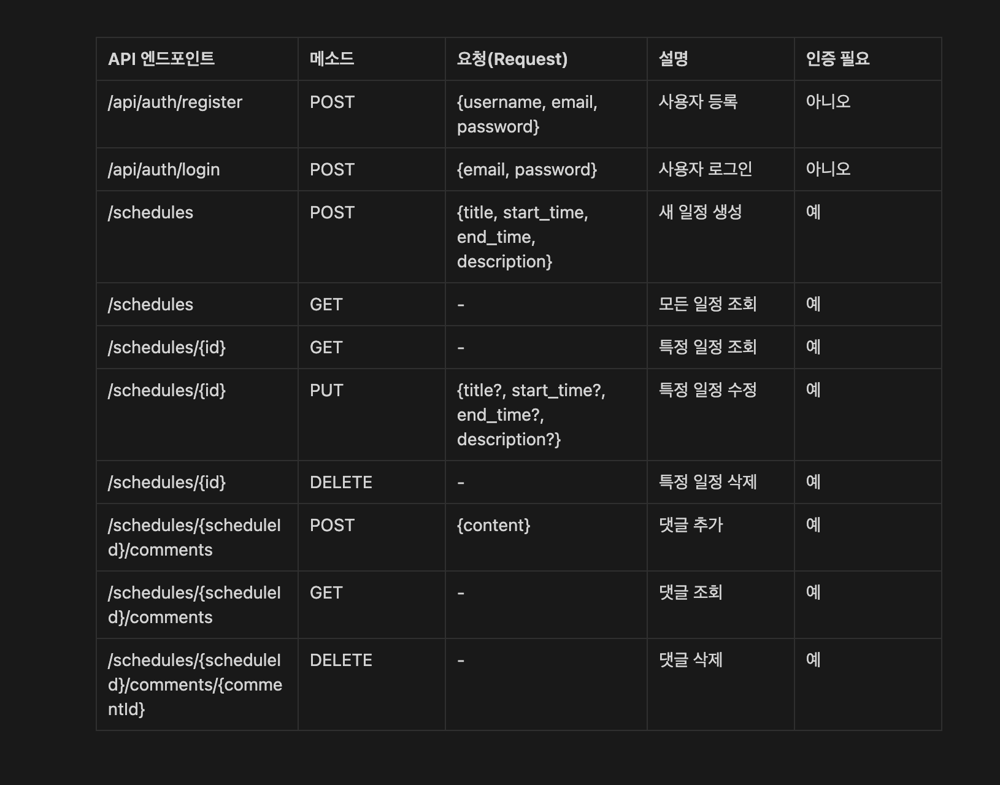
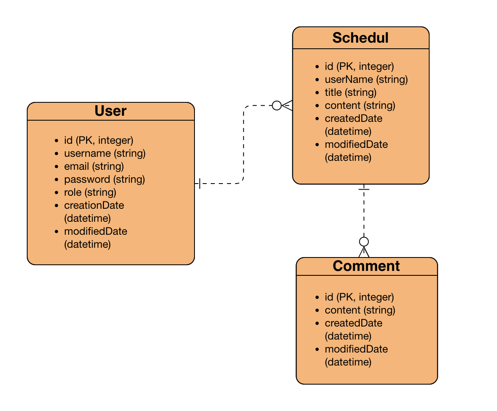

# [[ 데이터베이스 연결 정보 ]]
- **데이터베이스 URL**: `jdbc:mysql://localhost:3306/schedule`
- **사용자명**: `root`
- **비밀번호**: (사용자 설정에 따라 다름) <br><br><br>
  


# [[ 프로젝트 구조 ]]

```
sparta-scheduler/
├── src/
│   ├── main/
│   │   ├── java/
│   │   │   └── com/
│   │   │       └── sparta/
│   │   │           └── spartascheduler/
│   │   │               ├── controller/       # API 컨트롤러
│   │   │               ├── entity/           # JPA 엔티티
│   │   │               ├── exception/        # 사용자 정의 예외
│   │   │               ├── repository/       # JPA 레포지토리
│   │   │               ├── security/         # 보안 관련 코드
│   │   │               ├── service/          # 서비스 레이어
│   │   │               └── util/             # 유틸리티 클래스
│   │   ├── resources/
│   │   │   ├── application.properties         # 설정 파일
│   │   │   └── static/                        # 정적 리소스 (CSS, JS 등)
│   │   └── webapp/                            # 웹 관련 리소스
│   └── test/
│       └── java/
│           └── com/
│               └── sparta/
│                   └── spartascheduler/
│                       └── ...               # 테스트 클래스
├── pom.xml                                     # Maven 의존성 관리
└── README.md                                   # 프로젝트 설명서
```


## [[ API 명세서 ]]


## [[ ERD ]]

